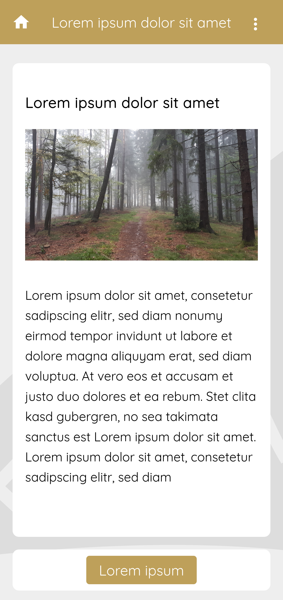
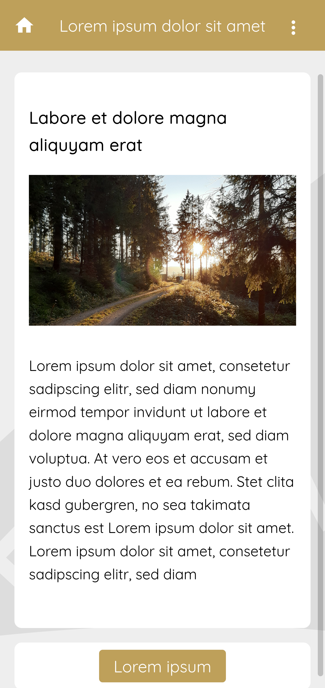
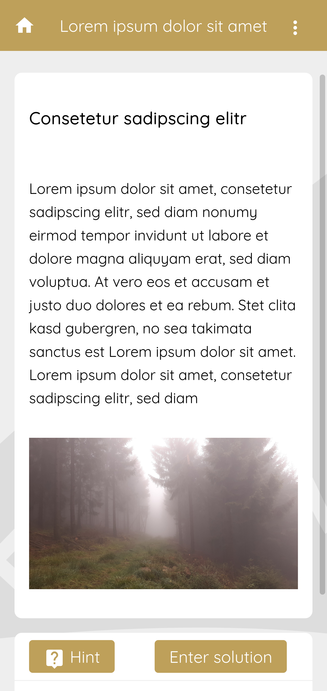
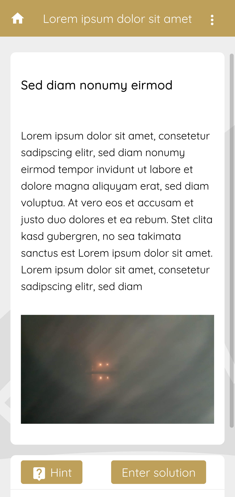
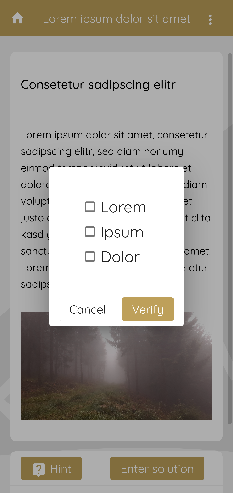
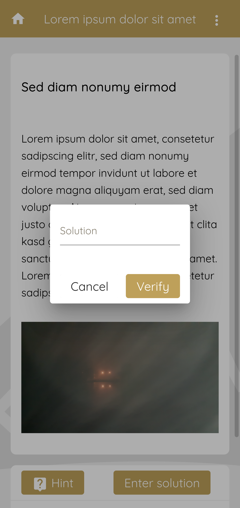
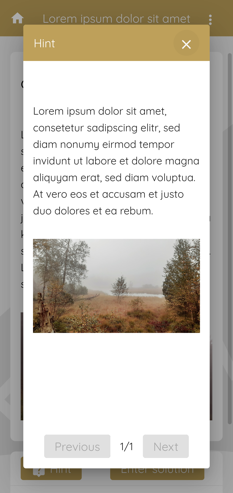
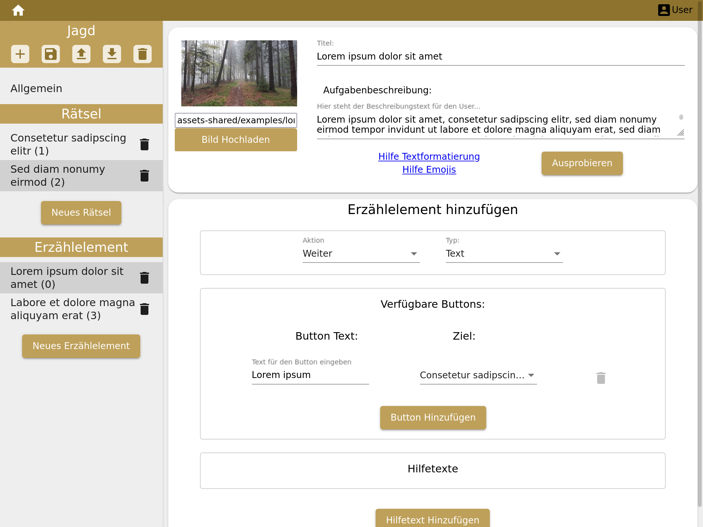

# Odyquest

The project Odyquest is a framework for scavenger hunts and escape games.
The heart is a web app.
It tells a story which leads you for example through a exhibition in a museum discovering the small details
while hunting for a ghost or helping a robot travelling back to the future.

The project consists of three parts:

* a web app as frontend for users,
* a server as data backend for data storage,
* and a CMS for game creation and editing.

* [Installation guide](documentation/installation.md)
* [Documentation for developers](documentation/development.md)

## Build instructions

Short summary to build all parts:
```bash
# First build the libraries
(cd odyquest-shared/chase-model && npm install && npm run build)
(cd odyquest-frontend-shared && npm install && npm run build)
# Then the applications
(cd odyquest-app && npm install && npm run build)
(cd odyquest-cms && npm install && npm run build)
(cd odyquest-data-backend && npm install && npm run build)
```

## Features

### Narrative elements for story telling

<table>
  <tr>
    <th width="50%">
      <p></p>
    </th>
    <th width="50%">
      <p></p>
    </th>
  </tr>
</table>

### Quest elements with different input types

<table>
  <tr>
    <th width="50%">
      <p></p>
    </th>
    <th width="50%">
      <p></p>
    </th>
  </tr>
  <tr>
    <th width="50%">
      <p></p>
    </th>
    <th width="50%">
      <p></p>
    </th>
  </tr>
</table>

### Hints

<table>
  <tr>
    <th width="100%">
      <p></p>
    </th>
  </tr>
</table>

### CMS for game creation and editing

<table>
  <tr>
    <th width="100%">
      <p></p>
    </th>
  </tr>
</table>

### OAuth2 Authentication for Modification

Use OAuth2 authentication service to protect editing the data and cms access.
You can use a existing authentication service or set up your own by using e.g. Keycloak.

### Localization/Translations

The static text elements in the web app are fully localized, the supported languages are English and German for the moment.
The language will be selected by the default language of the browser.

For actual games (chases) there is no localization functionality provided on purpose.
It is easier and more flexible to create multiple chases to cover multiple languages.

